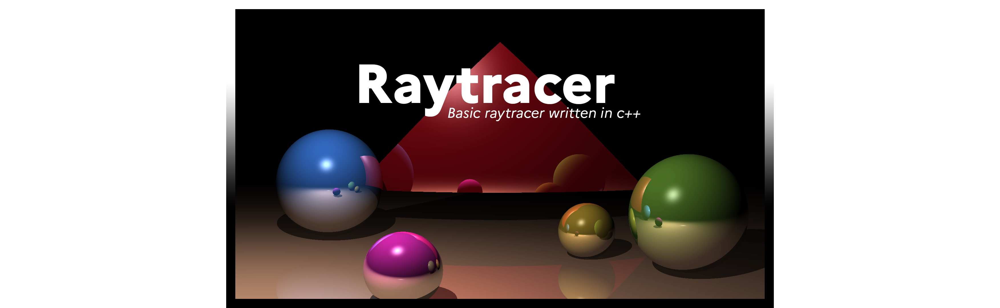

    Some raytracer including basic features such as shadows & reflection

## Building

Building requires C++17 installed.

- `mkdir build`
- `cd build`
- `cmake ..`
- `make`

## Running

- `./raytracer [width] [height] [fov] [outputName]`

## Config

The program can be run dynamically without recompiling when updating the scene. This can be done within the `config.json` file. Check the format to play with it.

## Features

- Diffuse and specular lighting
- Shadows
- Reflection

## Shapes

- Sphere
- Box
- Plane
- Triangle
- Mengen Sponge (fractale)
